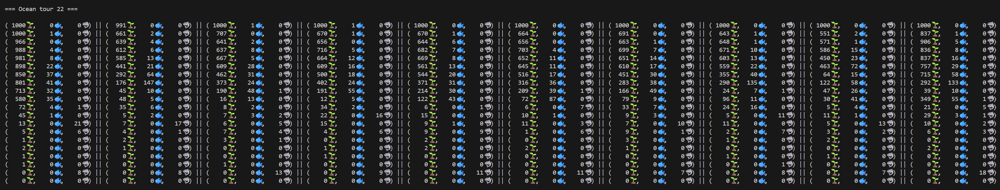

# AquaSim

Simulation d’un écosystème marin avec des algues, des poissons herbivores et des carnivores, codée en C++.



## Description

Ce projet simule la vie dans un océan représenté par une grille de cellules. Chaque cellule peut contenir différents agents :

* Algae (Algues) : se déplacent, se reproduisent et prennent de la lumière.

* HerbivoreFish (Poissons herbivores) : mangent les algues, se reproduisent et se déplacent selon la présence de nourriture.

* CarnivoreFish (Poissons carnivores) : mangent les herbivores, se reproduisent et se déplacent en fonction de leur faim et de leur satiété.

La simulation suit les règles suivantes :

Les algues peuvent se déplacer jusqu’à 8 cases et se reproduisent si elles ont assez de vie.

Les herbivores se déplacent aléatoirement si des algues sont présentes ou montent vers le niveau 2 si aucune algue n’est visible. Ils se reproduisent s’ils ont au moins 80 de vie et 2 ans.

Les carnivores mangent les herbivores quand leur vie est inférieure à 70 et se reproduisent s’ils ont au moins 80 de vie et 7 ans. S’ils sont rassasiés, ils descendent dans l’océan.

## Fonctionnalités

Initialisation aléatoire de l’océan avec algues et poissons.
Mise à jour de l’état de l’océan à chaque tour :
* Manger
* Vieillissement
* Reproduction
* Déplacement
* Suppression des agents morts

## Affichage dans la console avec une représentation des cellules :

(  136🌱,  145🐟,    2🦈) || (  166🌱,  156🐟,    1🦈) ...

## Build du projet

Le projet utilise CMake pour compiler la lib, l’application principale et les tests.

```bash
# Créer un dossier build et configurer le projet
mkdir build
cd build
cmake ..

# Compiler le projet et les tests
cmake --build .
```

## Lancer l’application principale

```bash
# Depuis le dossier build
./AquaSimMain
```

## Lancer les tests

Le projet utilise GoogleTest pour les tests unitaires.

```bash
# Lancer tous les tests
./tests/runTests

# Lancer un test spécifique
./tests/runTests --gtest_filter=AlgaeTest.*

# Voir la liste des tests disponibles
./tests/runTests --gtest_list_tests
```

## Coverage de code

Le projet fournit un script coverage.sh qui compile le projet avec les flags de couverture, lance les tests et génère un rapport HTML.

Utilisation

```bash
./coverage.sh
```

* Sous WSL : le dossier du rapport s’ouvre automatiquement dans l’explorateur Windows, et vous pouvez double‑cliquer sur index.html pour visualiser le rapport dans un navigateur.

* Sous Linux : le script tente d’ouvrir le rapport avec xdg-open. Sinon, ouvrez build/coverage-report/index.html manuellement.

## Nettoyer le projet

Pour supprimer tous les fichiers de build :

```bash
rm -rf build
```